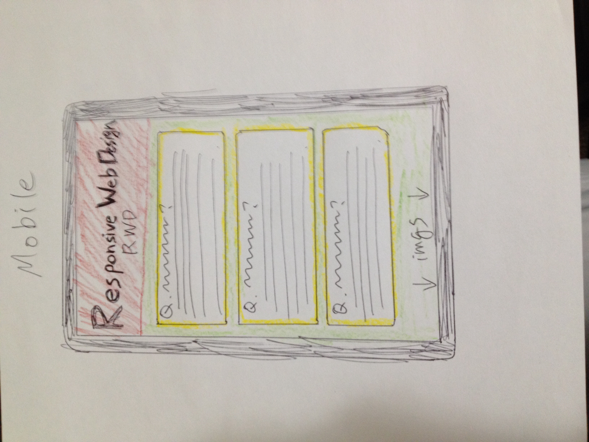
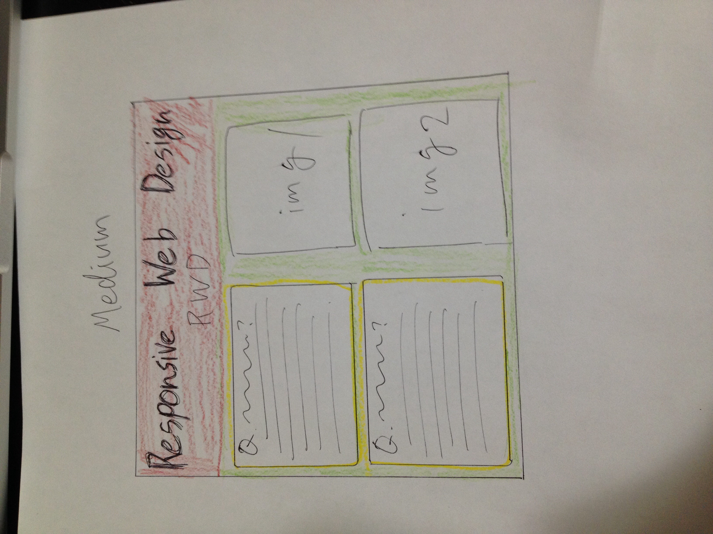
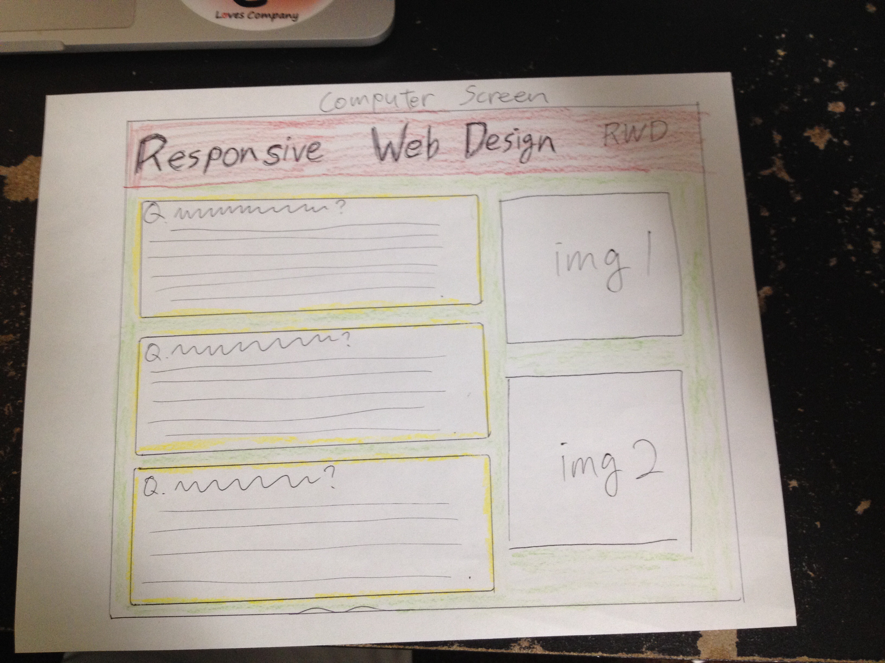

<h1>Kazuya's README for Project 4</h1>
 
 
<li><b>What is the information this page aims to deliver?</b>

-Tells viewers about what responsive web design is, especially for people who wants to know about web design. I think most of the elementary web designers don't know about this technique so this page tells them the idea of this technique and what it is about.

 
<li><b>What is the first information on the page that should draw the eye?</b>
 

-I have to tell viewers what I am talking about when they visit this website, so the first information that I need to tell them is the title "responsive web design." By this title, they could know I'm talking about it and it is some type of technique for web design.

 
<li><b>What is the primary content of this page?</b>

-Description of responsive web design. This is the main part of this page where viewers could understand about the basic idea of responsive web design.

 
<li><b>What is the secondary content?</b>

-I give experimental elements in this page that viewers can play and see responsive web design and understand how it look like. This is the secondary content of the page.

 
 
<h4>Content items</h4>
<li>comparable images of responsive web design
<li>video showing the action
 
<h4>Sketch</4>

It is not too hard to sketch and build a website for now, which is I really impressed myself. However, this week we learned many contents about responsive web design that I feel easy to understand its idea but really hard to accomplish it by action. Since I finished to go through the class website's instruction, I was ready to build the website with easy mind. However, it is actually really hard to set up the contents' position and scale because I missed what I was trying to do too many times, and it was totally far away from my sketch so it took too long and rearranged it too many times.
